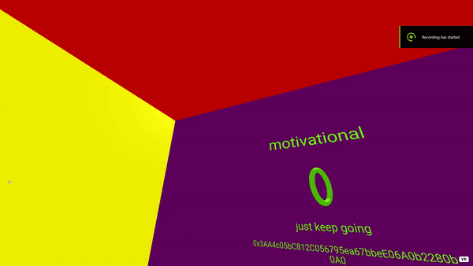
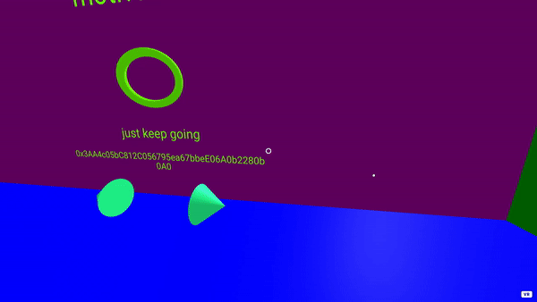
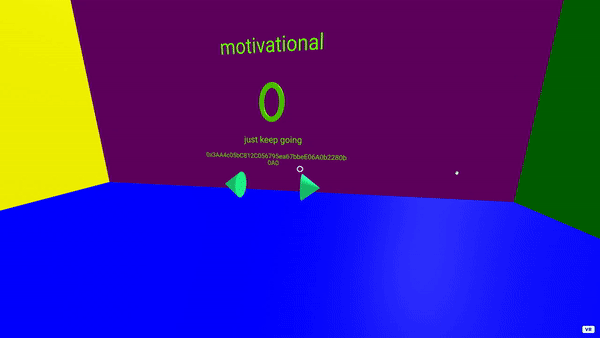
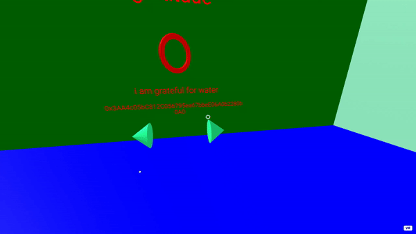

# pomogra

A chain of rings rendered in Unity with the help of Solidity containing messages of motivation, positivity and gratitude from users all over!

Hello and welcome to Pomogra! Pomogra is a React WebApp that runs on your desktop and is powered by AFrame and Solidity to create a room of awesome messages.

## setup

- `git clone` this project into your respective directory
- `npm install` all the packages
- `npm start` then headover to `https://localhost:3000` when the project compiles

## controls

### movement

Use the 'WASD' controls to move around.

### camera look

Use the left mouse button to click and drag to look around.

### cycling through messages / ring types

Use the gaze cursor in the middle to highlight an arrow (either one), then click with the left mouse button to cycle between messages or ring types.

### writing and sending a message

Head on over to the main terminal with the keyboard, select your ring type (positive, motivational or gratitude) and click on the keyboard keys to type your message.

After you are done, gaze at the `Send` button and click using your left mouse button to send the transaction. This opens up MetaMask to ask you permission to send the transaction. Click accept and wait for the transaction to complete.

